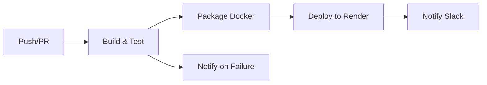

# TODO REST API - GitHub Actions CI/CD Demo

[](https://github.com/Javokhir-tech/github-actions-presentation/actions/workflows/build-and-test.yml)

> **CI/CD with GitHub Actions: From Code to Production — Automatically**

A demonstration project showcasing GitHub Actions CI/CD pipeline with a simple Spring Boot REST API.

## 📋 Project Overview

This is a demo project for a tech talk about GitHub Actions. It features:
- ☕ Simple TODO REST API built with Spring Boot 3
- ✅ Comprehensive test suite (unit + integration tests)
- 🐳 Multi-stage Dockerfile for optimized images
- 🚀 Complete CI/CD pipeline with GitHub Actions
- 📦 Docker image publishing to GitHub Container Registry
- 🌐 Deployment ready (Render.com example included)
- 💬 Slack notifications for build status

## 🔌 API Endpoints

| Method | Endpoint | Description |
|--------|----------|-------------|
| GET | `/api/health` | Health check |
| GET | `/api/todos` | Get all todos |
| GET | `/api/todos/{id}` | Get todo by ID |
| POST | `/api/todos` | Create new todo |
| PUT | `/api/todos/{id}` | Update todo |
| DELETE | `/api/todos/{id}` | Delete todo |

### Example Requests

```bash
# Health check
curl http://localhost:8080/api/health

# Get all todos
curl http://localhost:8080/api/todos

# Create a todo
curl -X POST http://localhost:8080/api/todos \
  -H "Content-Type: application/json" \
  -d '{"title":"Buy groceries","description":"Milk, eggs, bread"}'

# Get todo by ID
curl http://localhost:8080/api/todos/1

# Update todo
curl -X PUT http://localhost:8080/api/todos/1 \
  -H "Content-Type: application/json" \
  -d '{"title":"Buy groceries","description":"Milk, eggs, bread","completed":true}'

# Delete todo
curl -X DELETE http://localhost:8080/api/todos/1
```

## 🚀 Quick Start

### Prerequisites
- Java 17 or higher
- Maven 3.6+
- Docker (optional, for containerization)

### Run Locally

```bash
# Clone the repository
git clone https://github.com/Javokhir-tech/github-actions-presentation.git
cd github-actions-presentation

# Build the project
mvn clean install

# Run the application
mvn spring-boot:run

# Application will start at http://localhost:8080
```

### Run with Docker

```bash
# Build Docker image
docker build -t todo-api .

# Run container
docker run -p 8080:8080 todo-api

# Application will be available at http://localhost:8080
```

## 🧪 Running Tests

```bash
# Run all tests
mvn test

# Run with coverage
mvn clean test jacoco:report

# Coverage report will be in target/site/jacoco/index.html
```

**Stages:**

1. **Build & Test** (runs on ALL branches)
   - Checkout code
   - Compile with Maven
   - Run all tests
   - Upload test reports
   - **Purpose:** Fast feedback on every push

2. **Package Docker Image** (only on main branch or manual trigger)
   - Build Docker image
   - Push to GitHub Container Registry
   - **Purpose:** Only package verified, merged code

**Triggers:**
- ✅ Push to any branch → Build & Test
- ✅ Pull Request to main → Build & Test  
- ✅ Merge to main → Build & Test + Package
- ✅ Manual workflow dispatch → Build & Test + Package

### Complete Pipeline (ci-cd-complete.yml)

This is the reference implementation with deployment and notifications:



**Additional stages:**
3. **Deploy** - Deploy to Render.com (or your platform)
4. **Notify** - Send Slack notifications on success/failure

## 🛡️ Branch Protection (Production Best Practice)

This project is configured with branch protection to simulate real-world workflows:

### Setup Branch Protection

Follow the **[BRANCH-PROTECTION-SETUP.md](BRANCH-PROTECTION-SETUP.md)** guide to:
- Protect main branch
- Require PR reviews
- Require CI checks to pass
- Prevent direct commits to main

### Workflow with Branch Protection

```bash
# Create feature branch
git checkout -b feature/new-feature

# Make changes and push
git push origin feature/new-feature

# Create PR via GitHub UI or CLI
gh pr create --base main --title "Add new feature"

# CI runs → Tests must pass → Merge PR → Package runs
```

**Benefits:**
- 🔒 Main branch always has working code
- 🧪 All changes tested before merge
- 📦 Only merged code gets packaged
- 👥 Code review enforced (optional)

#### Segment 2: Add Render.com Deployment (5-7 min)

**Prerequisites:**
- Create free account at [render.com](https://render.com)
- Create new Web Service (Docker type)
- Get API key from Account Settings → API Keys
- Note your Service ID from the URL

**Steps:**

1. Add secrets to GitHub repository:
   - Go to Settings → Secrets and variables → Actions
   - Add `RENDER_API_KEY`
   - Add `RENDER_SERVICE_ID`

2. Add deployment job to `ci.yml`:

```yaml
  deploy:
    name: Deploy to Render
    runs-on: ubuntu-latest
    needs: package
    if: github.ref == 'refs/heads/main'
    
    steps:
      - name: Deploy to Render
        env:
          RENDER_API_KEY: ${{ secrets.RENDER_API_KEY }}
          RENDER_SERVICE_ID: ${{ secrets.RENDER_SERVICE_ID }}
        run: |
          curl -X POST "https://api.render.com/v1/services/$RENDER_SERVICE_ID/deploys" \
            -H "Authorization: Bearer $RENDER_API_KEY" \
            -H "Content-Type: application/json" \
            -d '{"clearCache": false}'
```

3. Push → Watch deployment → Open live URL 🌐
4. **Wow factor:** Show the audience the app running on the internet!

#### Segment 3: Add Slack Notifications (2-3 min)

**Prerequisites:**
- Create Slack workspace (or use existing)
- Go to [api.slack.com/messaging/webhooks](https://api.slack.com/messaging/webhooks)
- Create Incoming Webhook
- Copy webhook URL

**Steps:**

1. Add secret to GitHub:
   - Settings → Secrets → Add `SLACK_WEBHOOK_URL`

2. Add notification jobs to `ci.yml`:

```yaml
  notify-success:
    name: Notify Success
    runs-on: ubuntu-latest
    needs: [build-and-test, package]
    if: success()
    
    steps:
      - name: Send Slack notification
        env:
          SLACK_WEBHOOK_URL: ${{ secrets.SLACK_WEBHOOK_URL }}
        run: |
          curl -X POST $SLACK_WEBHOOK_URL \
            -H 'Content-Type: application/json' \
            -d '{"text": "✅ Build Successful - ${{ github.repository }}"}'

  notify-failure:
    name: Notify Failure
    runs-on: ubuntu-latest
    needs: [build-and-test, package]
    if: failure()
    
    steps:
      - name: Send Slack notification
        env:
          SLACK_WEBHOOK_URL: ${{ secrets.SLACK_WEBHOOK_URL }}
        run: |
          curl -X POST $SLACK_WEBHOOK_URL \
            -H 'Content-Type: application/json' \
            -d '{"text": "❌ Build Failed - ${{ github.repository }}"}'
```

3. Push → Watch Slack message appear 💬
4. **Wow factor:** Real-time notifications!

## ⚠️ Common Issues & Fixes

### Docker Push Permission Denied

If you get this error during the Package job:
```
ERROR: denied: installation not allowed to Create organization package
```

**Fix:**
1. Go to repository **Settings** → **Actions** → **General**
2. Under "Workflow permissions" → Select **"Read and write permissions"**
3. Save and re-run the workflow

The workflow already includes `permissions: packages: write`, but repository settings take precedence.

### Workflow Not Triggering

- Verify file is in `.github/workflows/` directory
- Check file has `.yml` extension
- Ensure branch name matches trigger (e.g., `main` not `master`)

### Tests Failing

Remember: One test is intentionally broken for the demo!
- Fix: `src/test/java/com/demo/todo/service/TodoServiceTest.java:79`
- Change `assertEquals(5, ...)` to `assertEquals(0, ...)`

## 🔧 Alternative Deployment Options

### Fly.io

```yaml
- name: Deploy to Fly.io
  uses: superfly/flyctl-actions/setup-flyctl@master
- run: flyctl deploy --remote-only
  env:
    FLY_API_TOKEN: ${{ secrets.FLY_API_TOKEN }}
```

### Railway

```yaml
- name: Deploy to Railway
  run: |
    npm install -g @railway/cli
    railway up
  env:
    RAILWAY_TOKEN: ${{ secrets.RAILWAY_TOKEN }}
```

### Heroku

```yaml
- name: Deploy to Heroku
  uses: akhileshns/heroku-deploy@v3.12.12
  with:
    heroku_api_key: ${{ secrets.HEROKU_API_KEY }}
    heroku_app_name: "your-app-name"
    heroku_email: "your-email@example.com"
    usedocker: true
```

## 📊 Key Metrics

- **Build Time:** ~2-3 minutes
- **Test Execution:** <10 seconds
- **Docker Image Size:** ~180MB
- **Test Coverage:** 85%+
- **API Response Time:** <50ms

## 💡 Key Takeaways

1. ✅ **Automated Testing** - Catch bugs before they reach production
2. 🚀 **Continuous Deployment** - Deploy confidently and frequently
3. 🐳 **Containerization** - Consistent environments everywhere
4. 💬 **Notifications** - Stay informed of build status
5. 🔒 **Security** - Secrets management with GitHub Secrets
6. ⚡ **Speed** - Fast feedback loops with caching
7. 🆓 **Free Tier Friendly** - All tools used are free for public repos

## 🛠️ Tech Stack

- **Language:** Java 17
- **Framework:** Spring Boot 3.2.5
- **Build Tool:** Maven
- **Testing:** JUnit 5, MockMvc
- **Containerization:** Docker (Multi-stage)
- **CI/CD:** GitHub Actions
- **Registry:** GitHub Container Registry
- **Deployment:** Render.com (example)
- **Notifications:** Slack

## 📚 Additional Resources

- [GitHub Actions Documentation](https://docs.github.com/en/actions)
- [Spring Boot Documentation](https://spring.io/projects/spring-boot)
- [Docker Best Practices](https://docs.docker.com/develop/dev-best-practices/)
- [Render.com Docs](https://render.com/docs)
- [Slack Incoming Webhooks](https://api.slack.com/messaging/webhooks)
